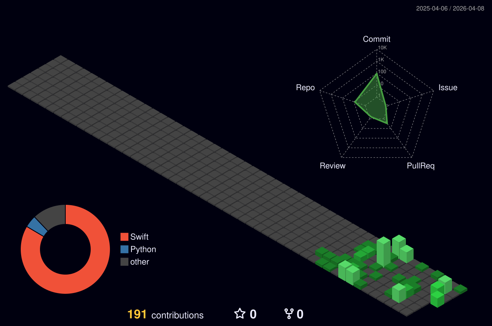

<div align="center">

<!-- Aurora Gradient Header -->


<!-- Typing Animation -->
<a href="https://git.io/typing-svg"></a>

<!-- Profile Views -->
<br/>


</div>

<br/>

<!-- ═══════════════════════ ABOUT ═══════════════════════ -->

##  &nbsp;About Me

```yaml
name: Emirhan Yıldız
role: Computer Engineering Student
location: Turkey 🇹🇷
interests:
  - Artificial Intelligence & Machine Learning
  - Quantitative Trading Systems
  - Software Architecture & Design Patterns
  - Data Analysis & Visualization
  - Automation & DevOps
currently_learning: [ "Deep Learning", "Algorithmic Trading", "System Design" ]
fun_fact: "Building systems that scale — from code to capital."
```

<br/>

<!-- ═══════════════════════ TECH STACK ═══════════════════════ -->

##  &nbsp;Tech Stack & Skills

<div align="center">

<!-- Animated Skill Bars -->
<table>
<tr><td>

### Languages
<a href="https://skillicons.dev">
  
</a>

<br/><br/>

<!-- Python -->
`Python` ████████████████████░░ **90%**

<!-- C++ -->
`C++` ███████████████░░░░░░ **75%**

<!-- Swift -->
`Swift` █████████████░░░░░░░░ **65%**

<!-- JavaScript -->
`JavaScript` ████████████░░░░░░░░░ **60%**

</td><td>

### AI / ML & Data
<a href="https://skillicons.dev">
  
</a>

<br/><br/>

### Tools & Platforms
<a href="https://skillicons.dev">
  
</a>

<br/><br/>

### Databases & Cloud
<a href="https://skillicons.dev">
  
</a>

</td></tr>
</table>

</div>

<br/>

<!-- ═══════════════════════ GITHUB ANALYTICS ═══════════════════════ -->

##  &nbsp;GitHub Analytics

<div align="center">
  
  
</div>

<br/>

<div align="center">
  
</div>

<br/>

<!-- ═══════════════════════ TROPHIES ═══════════════════════ -->

##  &nbsp;Achievements

<div align="center">
  
</div>

<br/>

<!-- ═══════════════════════ SNAKE ANIMATION ═══════════════════════ -->

## 🐍 Contribution Snake

<div align="center">
  <picture>
    <source media="(prefers-color-scheme: dark)" srcset="https://raw.githubusercontent.com/emirhan2823/emirhan2823/output/github-snake-dark.svg" />
    <source media="(prefers-color-scheme: light)" srcset="https://raw.githubusercontent.com/emirhan2823/emirhan2823/output/github-snake.svg" />
    
  </picture>
</div>

<br/>

<!-- ═══════════════════════ ACTIVITY GRAPH ═══════════════════════ -->

## 📈 Contribution Graph

<div align="center">
  
</div>

<br/>

<!-- ═══════════════════════ 3D CONTRIB ═══════════════════════ -->

## 🌐 3D Contribution Calendar

<div align="center">
  
</div>

<br/>

<!-- ═══════════════════════ FOCUS AREAS ═══════════════════════ -->

## 🚀 What I'm Building

<div align="center">
<table>
<tr>
<td align="center" width="33%">

<h1>🤖</h1>
<strong>AI & Machine Learning</strong>
<br/>
<sub>Deep Learning, NLP, Computer Vision,<br/>Model Optimization</sub>

</td>
<td align="center" width="33%">

<h1>📈</h1>
<strong>Quantitative Trading</strong>
<br/>
<sub>Algorithmic Strategies, Backtesting,<br/>Signal Processing</sub>

</td>
<td align="center" width="33%">

<h1>⚙️</h1>
<strong>System Architecture</strong>
<br/>
<sub>Scalable Design, DevOps,<br/>Infrastructure Automation</sub>

</td>
</tr>
</table>
</div>

<br/>

<!-- ═══════════════════════ DETAILED STATS ═══════════════════════ -->

## 📊 Detailed Stats

<div align="center">
  
</div>
<div align="center">
  
  
  
</div>

<br/>

<!-- ═══════════════════════ QUOTE ═══════════════════════ -->

<div align="center">
  
</div>

<br/>

<!-- Aurora Gradient Footer -->

